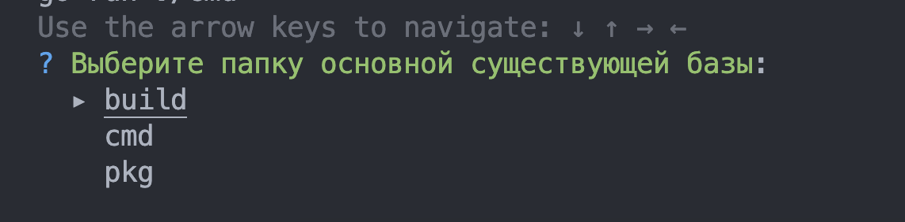
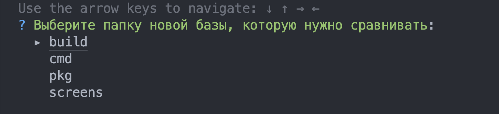
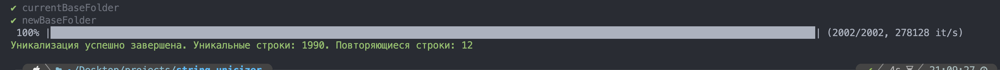

# Уникализатор строк 
Приложение сверяет новую базу строк с уже существующей. Строки должны храниться в .txt файле.

## Установка
```
git clone https://github.com/Hundred-Killer/string-unicizer
```
```
make run
```
или
```
go run ./cmd
```

Уникальные строки хранятся в папке output

## Скриншоты


